## IMPLEMENT A CLIENT SERVER ARCHITECTURE USING MYSQL DATABASE MANAGEMENT SYSTEM (DBMS).
### Implement a Client Server Architecture using MySQL Database Management System (DBMS). To demonstrate a basic client-server using MySQL Relational Database Management System (RDBMS), follow the below instructions

#### 1. Create and configure two Linux-based virtual servers (EC2 instances in AWS).

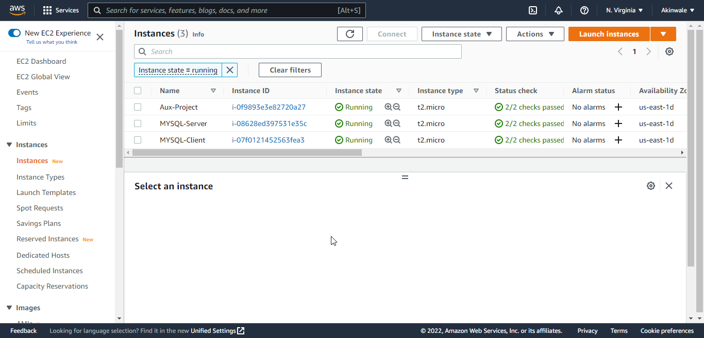

#### 2. On mysql server Linux Server install MySQL Server software.
`sude apt update`
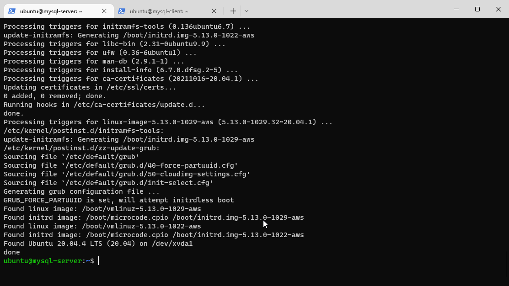

`sudo apt upgrade`
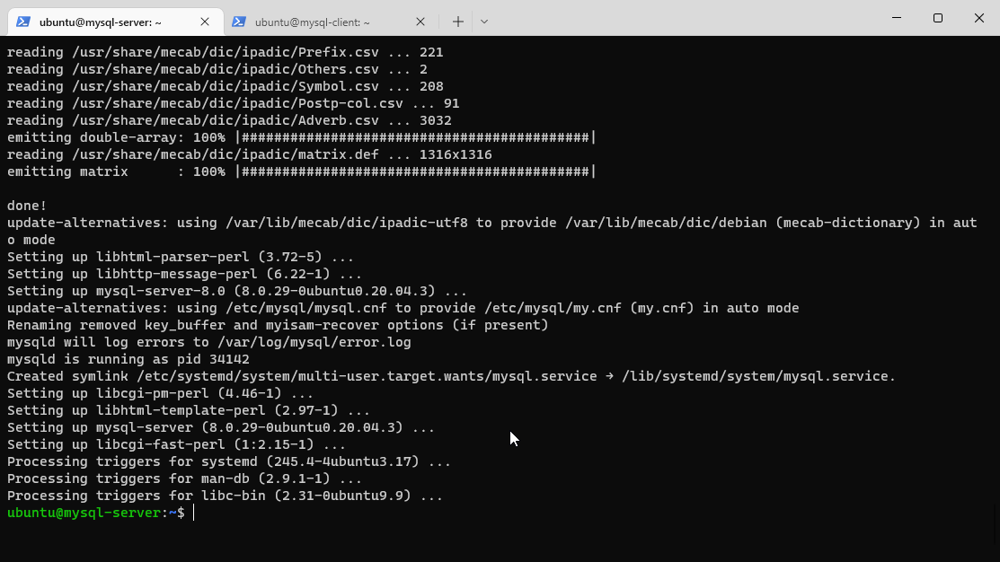

`sudo apt install mysql-server -y`
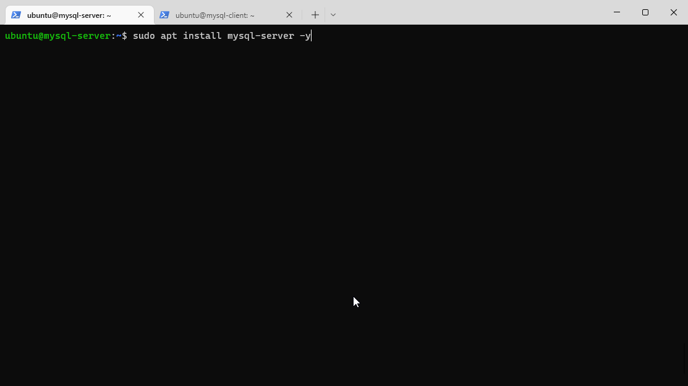

`sudo apt enable mysql`
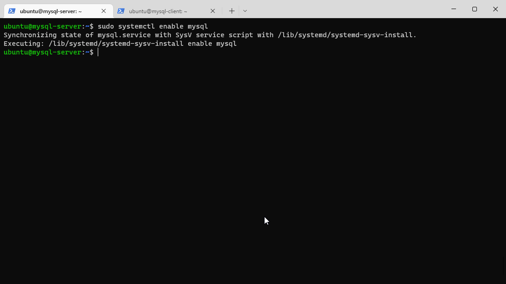

#### 3. On mysql client Linux Server install MySQL Client software.

`sudo apt update`
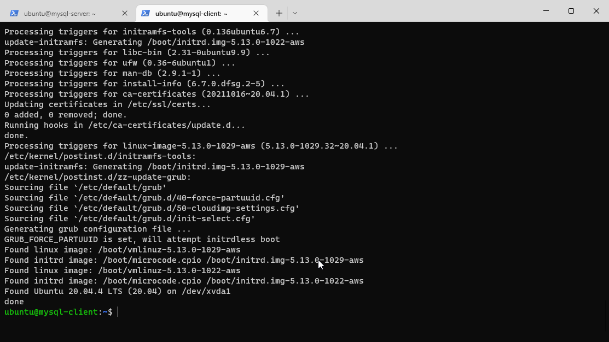

`sudo apt upgrade`
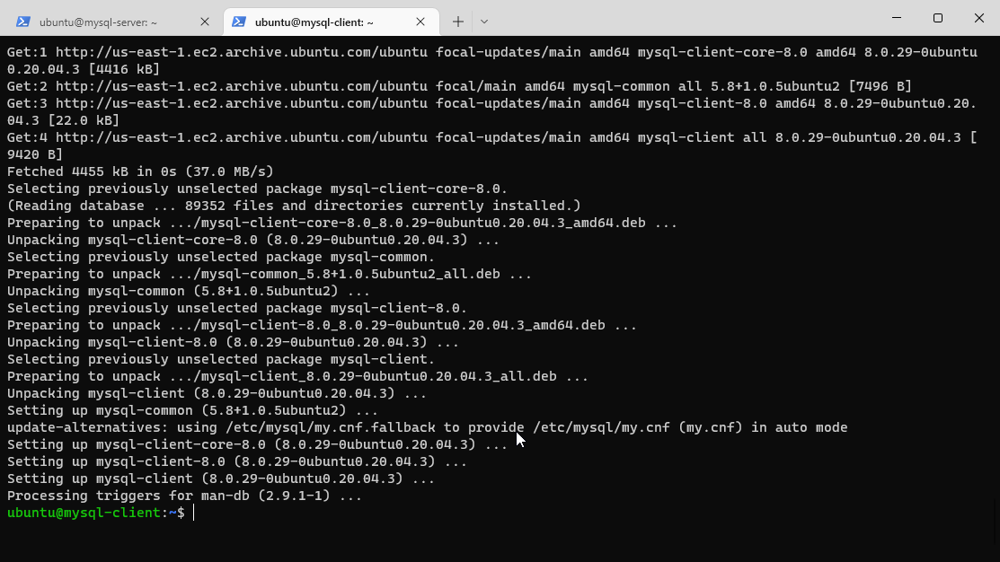

`sudo apt install mysql-client -y`

#### 4.  By default, both of my EC2 virtual servers are located in the same local virtual network, so they can communicate to each other using local IP addresses. I Use mysql server's local IP address to connect from mysql client. MySQL server uses TCP port 3306 by default, so I will have to open it by creating a new entry in ‘Inbound rules’ in ‘mysql server’ Security Groups. For extra security, I do not allow all IP addresses to reach my ‘mysql server’ – I allow access only to the specific local IP address of your ‘mysql client’.

####  5. You might need to configure MySQL server to allow connections from remote hosts.

`sudo vi /etc/mysql/mysql.conf.d/mysqld.cnf`

#### I Replace ‘127.0.0.1’ to ‘0.0.0.0’

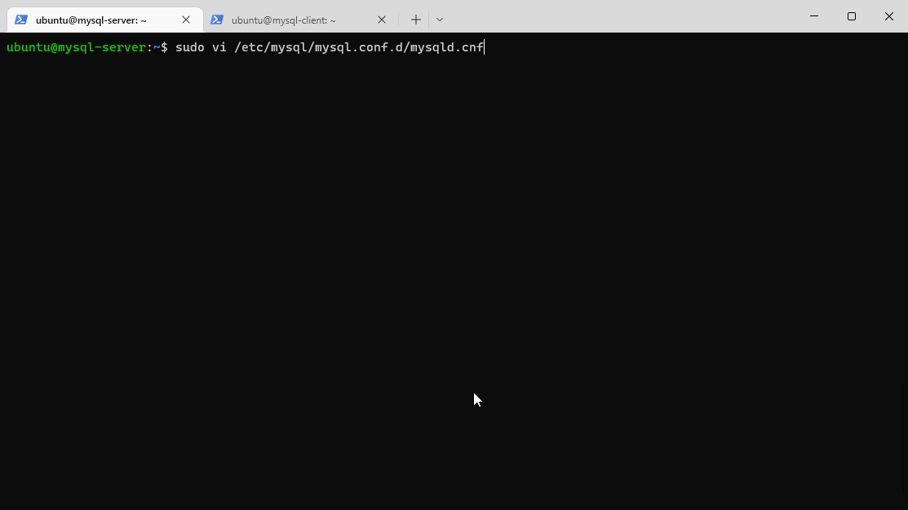

#### 6. From mysql client Linux Server I connect remotely to mysql server Database Engine without using SSH. I use the mysql utility to perform this action.

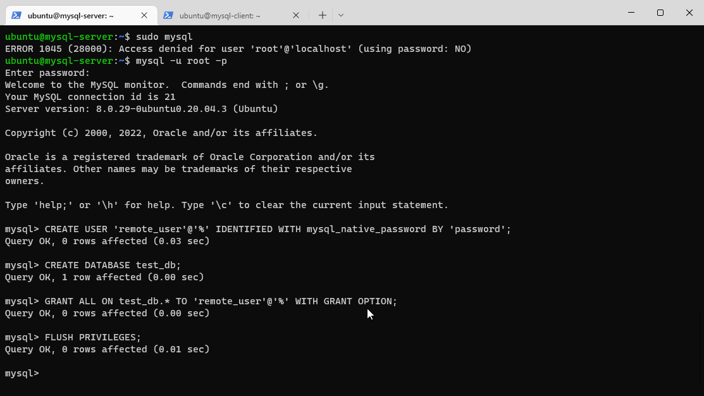

#### 7. I Check that I have successfully connected to a remote MySQL server and can perform SQL queries:

`Show databases;`
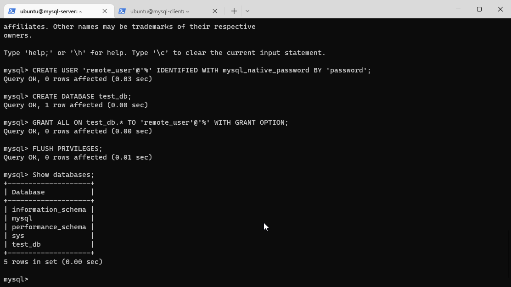

#### Client connection
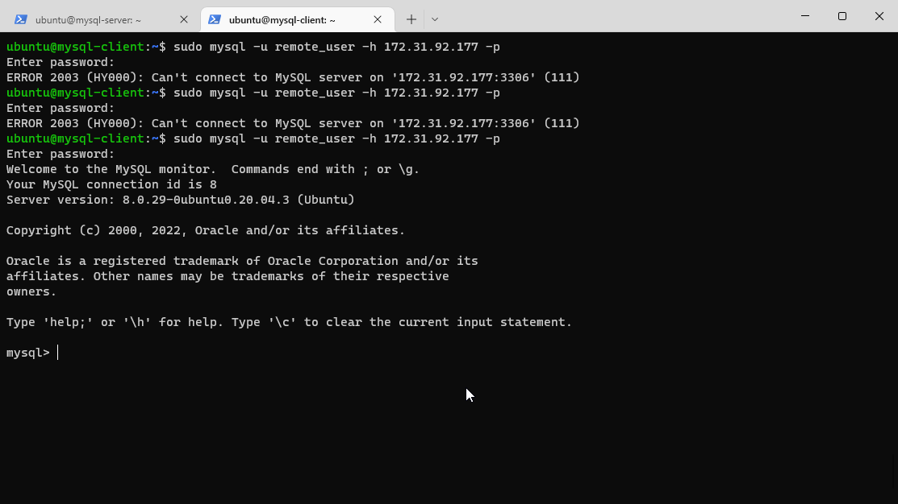

#### Client Show Database

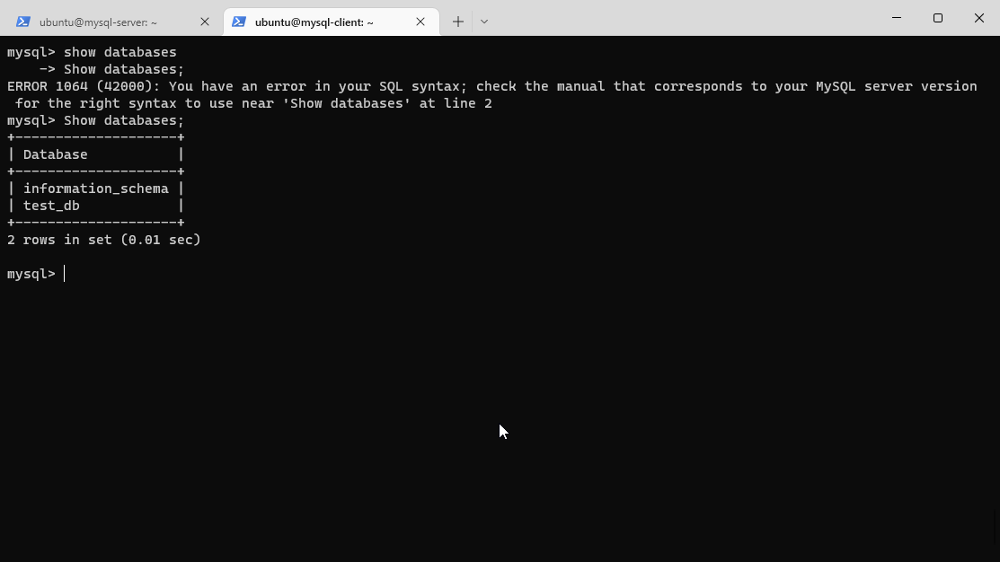

## END

